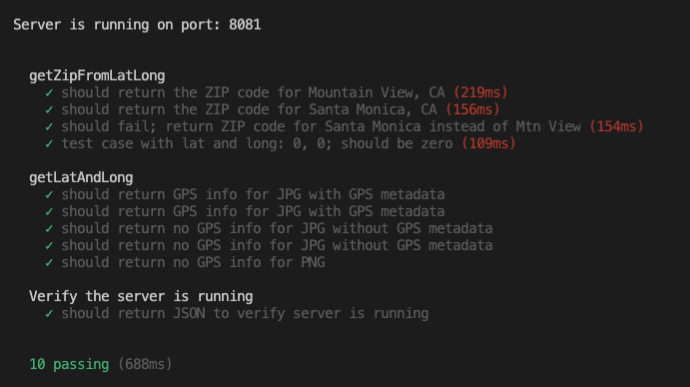
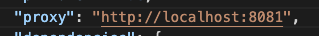
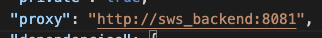

# Simple Web Service
This simple web service validates that an image is a JPEG. If it is a JPEG, we will return the ZIP code the image was taken in.


## Implementation Overview
I implemented this web service using React on the frontend and Express on the backend. For managing changes in state on the frontend, I used React hooks, and to communicate/make REST API calls to my backend, I used Axios. In order to check the file type, I extracted the MIME type from the base64 string and checked whether it was a jpg or jpeg type. To convert from a base64 string back to an image file, I used [Node's file system module](https://nodejs.org/api/fs.html). To extract image/exif metadata from an image, I used the [node-exif](https://github.com/gomfunkel/node-exif) library, and to convert latitude and longitude coordinates to a ZIP code, I used Big Data Cloud's [Reverse Geocoding to City API](bigdatacloud.com/geocoding-apis/free-reverse-geocode-to-city-api).

## Project Setup
Run ```npm install``` in the backend/ and client/ directories to install all of the project dependencies.
In backend/
```
npm install
```
In client/
```
npm install
```

## Running the app locally
To run the app locally, run ```node server.js``` from the backend/ directory and run ```npm start``` from the client/ directory.

In backend/
```
node server.js
```
In client/
```
npm start
```
If you want to run the app with hot-reloading, make sure you have [nodemon](https://www.npmjs.com/package/nodemon) installed, then run ```nodemon server.js``` from the backend/ directory and run ```nodemon start``` from the client/ directory.

In backend/
```
nodemon server.js
```
In client/
```
nodemon start
```

## Run tests
For this application, I wrote unit tests using Mocha, a JS test framework for synchronous and asynchronous testing. I also used the supertest library for making requests.

To get started with running the tests, verify that you have `mocha` and `supertest` installed by checking the package.json file in the backend/ directory, or by running the following commands in the backend/ directory:
```
npm install mocha supertest
```

To run the test suite, cd into the backend/ directory and run the command `npm test`.
```
cd backend/
```
```
npm test
```
The output should look like the following:


## Docker
To deploy to Docker, make sure you have [Docker](https://www.docker.com/get-started) installed on your machine. Check your installation by running ```docker --version```
```
docker --version
```
Go to the `client/` directory and change the "proxy" in `package.json` from "http://localhost:8081" to "http://sws_backend:8081".

From:

To:


Finally, you can run the images with the following command from the root directory of this project
```
docker-compose up
```

## Demo Scenarios
The following are common scenarios that occur with different file inputs.

### File is a JPEG, but no GPS metadata is available


### File is not a JPEG
